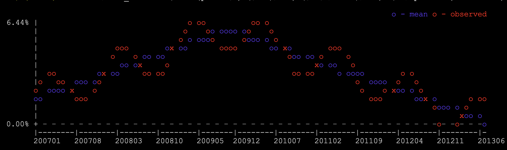

## Introduction
**tplot** is a perl script for minimalistic terminal plotting which is primarily designed for line plots for not more than 3 series. After all it's terminal plotting, any sophisticated plotting options will not fare well even if equipped. 

## Usage
```bash
Usage: tplot [-s "hieght, width"] [-y "min,max"] [-f format] [-l "legend1, legend2, .."] [file]
```

## Examples
```bash
% cat doc/test_dat.txt |awk '{print ($4+2)/100, ($4+$1/0.8+2)/100}' | tplot -l "mean,observed" -y0 -fp
```


